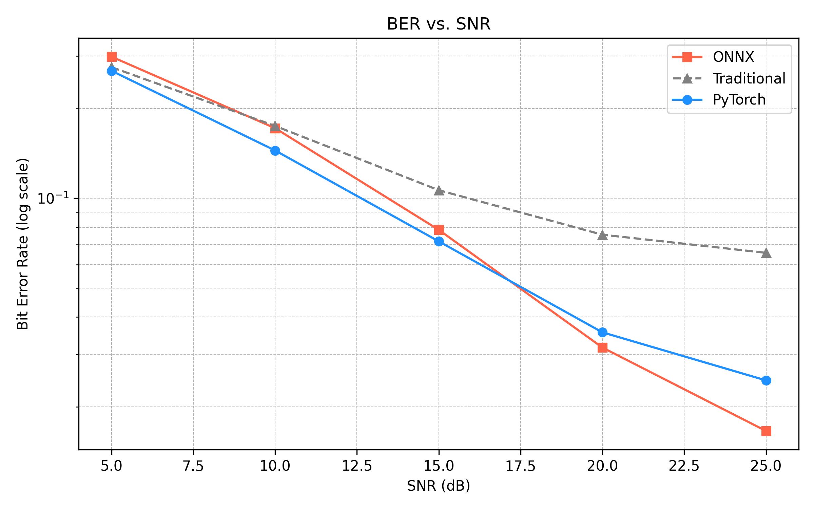
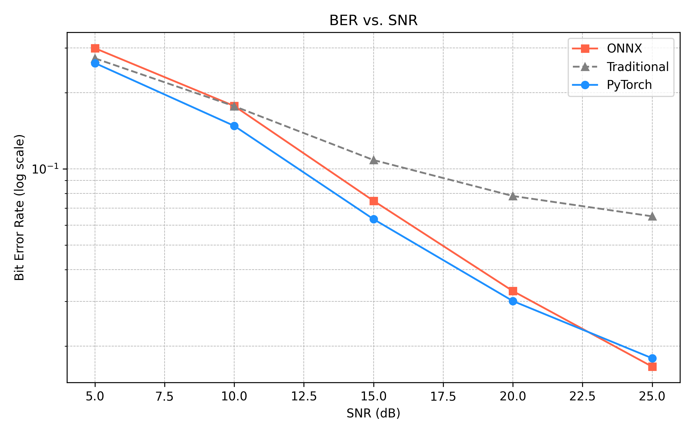
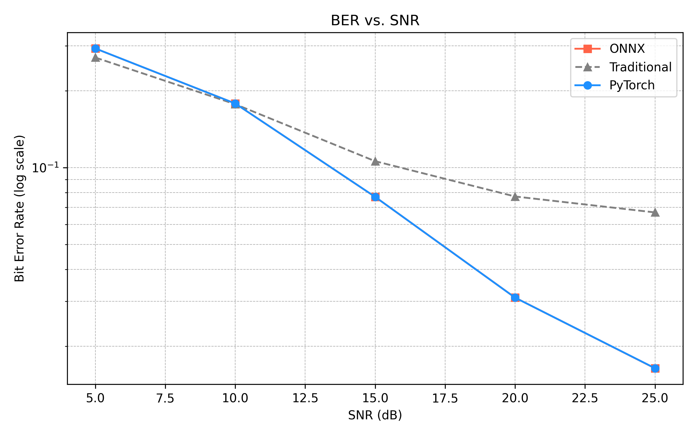

# 📡 Comparison of OFDM BER Performance Using MMSE Equalization and Machine Learning Models

This project benchmarks lightweight deep learning models (CNN, LSTM, Transformer) to **predict symbol error rate (SER)** in an OFDM system with frequency-selective fading. It compares these models against the traditional **MMSE equalizer** using both synthetic Rayleigh channels and DeepMIMO ray-tracing datasets.

---

## 🧠 Project Highlights

- 📶 Supports both **synthetic Rayleigh** and **DeepMIMO** channels
- 📐 Uses **16-QAM** modulation with **64 OFDM subcarriers**
- 📌 Uses **Zadoff-Chu** pilot sequences (9 subcarriers) for channel estimation
- 🤖 Models implemented: **1D CNN**, **2-layer LSTM**, **Transformer**
- 🧪 Baseline: **MMSE Equalizer**
- 📈 Metrics: **BIT Error Rate (BER)** vs **SNR**, loss curves, heatmaps
- ⚙️ Benchmarks **CUDA inference latency** for deployment

---

## ⚙️ System Model

We model the received OFDM signal as:

$y = h \cdot x + n$.

Where:
- \( x \): Transmitted OFDM symbol (64-point IFFT, 16-QAM modulated, with 9 pilots)
- \( h \): 3-tap frequency-selective Rayleigh fading channel
- \( n \): Additive white Gaussian noise (AWGN)
- \( y \): Received signal after passing through \( h \) and noise

---

## 🛠 Signal Pipeline

1. **Modulation**:
    - 16-QAM modulation to baseband symbols
2. **Subcarrier Mapping**:
    - 64 subcarriers total
    - 9 fixed pilots using Zadoff-Chu sequences
3. **IFFT**:
    - 64-point IFFT converts frequency to time domain
4. **Cyclic Prefix**:
    - Appended for multipath mitigation
5. **Channel**:
    - 3-tap Rayleigh fading with random complex gains
6. **Noise**:
    - AWGN with SNR randomly selected between 5 dB and 25 dB
7. **Receiver Input**:
    - Models receive real/imag parts of `y` and pilot-related features

---

## 🧠 Models Implemented

| Model             | Description                                                                                     | Parameter Count      |
|------------------|-------------------------------------------------------------------------------------------------|-----------------------|
| **SimpleCSINet3D**       | 3D CNN that processes input as a volume across (Rx, Tx, pilots). Fast and effective for spatial features. | 🏆 **18,490**          |
| **LSTMCSINet**           | Treats pilots as sequential input. Captures frequency correlation. Best when channel response has structure across L. | 235,552               |
| **TransformerCSINet**    | Uses self-attention across pilot subcarriers. Learns global relationships among antennas and subcarriers. | 537,760               |

**Input Format**: Each model receives input of shape `(batch, 4, N_rx, N_tx, L)`,  
where the 4 channels represent `[x_real, x_imag, y_real, y_imag]`.  
Real and imaginary parts of pilot and received signals are stacked along the channel dimension.

**Output Format**: The model outputs a predicted channel tensor \( \hat{H} \) of shape `(batch, N_rx, N_tx, L, 2)`,  
where the last dimension contains the real and imaginary components of the estimated channel matrix.

**Conclusion**: Among all models, the 3D CNN has the lowest parameter count (18K) while achieving the best trade-off between accuracy and latency.  
This lightweight nature makes it ideal for real-time CSI estimation and hardware deployment, especially under edge-device constraints.
### Input:

All models take 

input:
<pre> x_input: (batch, 64, 5) # 4 channels = [ y_real, y_imag, pilot_mask, pilot_real_value  , pilot_img_value ]  </pre> 

output:
<pre> y_output: (batch, 47, 2) # 2 channels = [ symbol_real, symbol_imag ]  </pre>

## 📊 Results & Visualizations

Below we present training results on both **Rayleigh** and **DeepMIMO** datasets for each model. We include:

- **Loss Curves**: Training vs. validation MSE loss across epochs. The dotted line indicates MMSE baseline.  
- **Heatmaps**: Visual comparison of true vs. predicted channel magnitudes for a selected sample.  
- **Residual Histograms**: Distribution of element-wise difference between predicted and true channels.

| Dataset   | Model       | MODEL BER vs MMSE BER                        |                  
|-----------|-------------|----------------------------------------------|
| Rayleigh  | CNN               |     | 
| Rayleigh  | LSTM        |         | 
| Rayleigh  | Transformer |   | 

---
